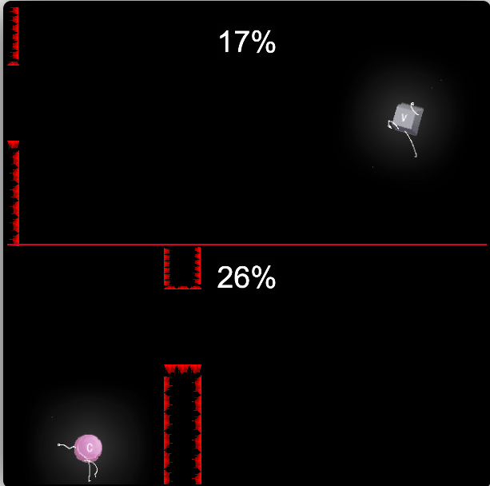

# lost-space

2019 厦门CiGA Game Jam参赛作品

寻找丢失的空格键，同屏双人竞速

键盘操作

左：一段空格跳跃，二段空格冲刺，A发射声波
右：一段回车跳跃，二段回车冲刺，L发射声波

声波碰到墙会消失，遇到缝隙会穿过

撞墙从头开始，撞到的障碍物会染上鲜血，下一次路过就会显示

先到达中心点胜利

**[https://potato47.github.io/lost-in-space/](https://potato47.github.io/lost-in-space/)**
